# Ticketing Platform

A modern ticketing and event registration platform built with Next.js 15, featuring QR code generation, email notifications, and PDF ticket generation.

## 📚 Diagrams

### Event Trace Diagram
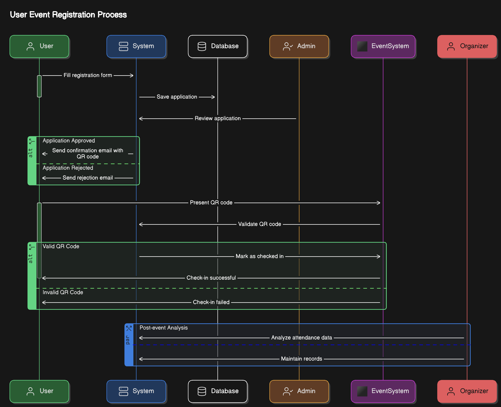
*Event trace diagram*

### Data Flow Diagram
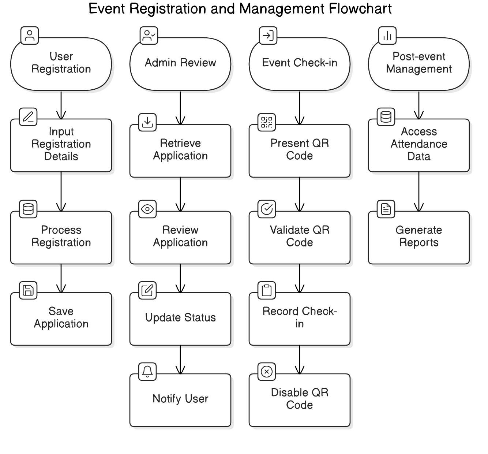
*Data flow diagram*

### Entity Relationship Diagram
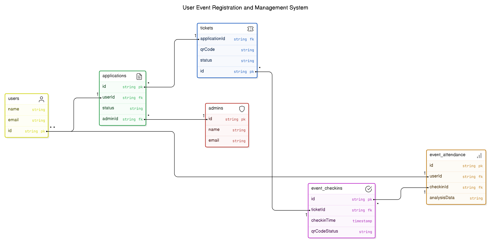
*Entity relationship diagram*

## 🚀 Key Features

- **Authentication & Authorization**
  - Secure user authentication using NextAuth.js
  - MongoDB adapter integration for user management
  - Protected API routes

- **QR Code System**
  - QR code generation for tickets using `qrcode` library
  - QR code scanning capabilities via `html5-qrcode`
  - Ticket validation system

- **Email Notifications**
  - Custom email templates for various notifications
  - Rejection and confirmation email support
  - Built using React Email components
  - Email service powered by Resend

- **PDF Generation**
  - Dynamic PDF ticket generation using `pdf-lib`
  - Custom ticket formatting and styling
  - Digital ticket delivery system

- **Modern UI/UX**
  - Built with Tailwind CSS
  - Radix UI components integration
  - Responsive design
  - Dark mode support
  - Custom shadcn/ui components

## 🛠️ Tech Stack

- **Frontend:**
  - Next.js 15
  - React 19
  - TypeScript
  - Tailwind CSS
  - Radix UI Components

- **Backend:**
  - MongoDB with Mongoose
  - NextAuth.js for authentication
  - API Routes

- **Utilities:**
  - PDF-lib for document generation
  - QR Code generation and scanning
  - React Hook Form with Zod validation
  - React Error Boundary for error handling

## 🚦 Getting Started

1. Clone the repository
2. Install dependencies:

```bash
yarn
```

3. Set up environment variables:
```bash
cp .env.example .env.local
```

4. Run the development server:
```bash
yarn dev
```

5. Open [http://localhost:3000](http://localhost:3000) to view the application

## 📝 Current Development Status

### Priority Tasks
- API route protection implementation
- Email validation fixes
- Analytics integration
- Navbar signin functionality
- Dashboard data fetching optimization

### Environment Requirements
- Node.js
- MongoDB database
- Email service provider (Resend)


## 📚 Screenshots

### Registration Page
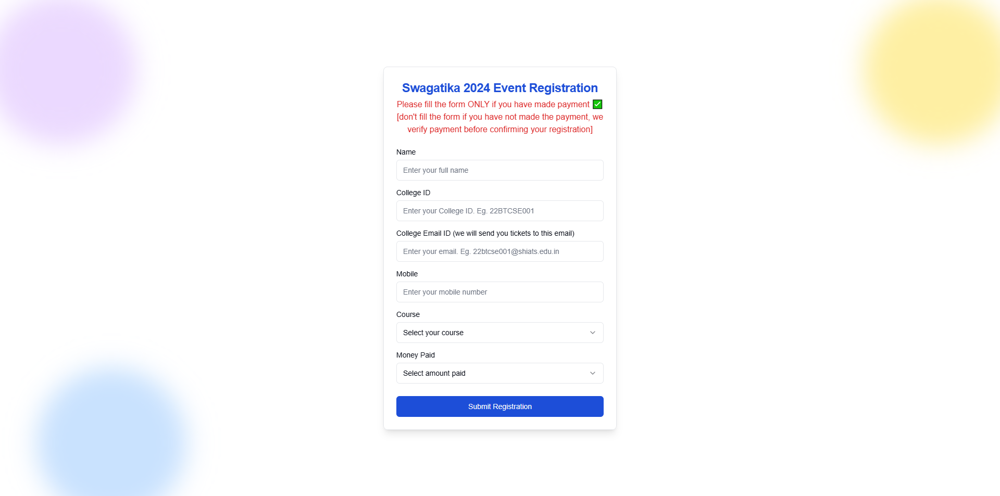
*User registration interface*

### Admin Dashboard
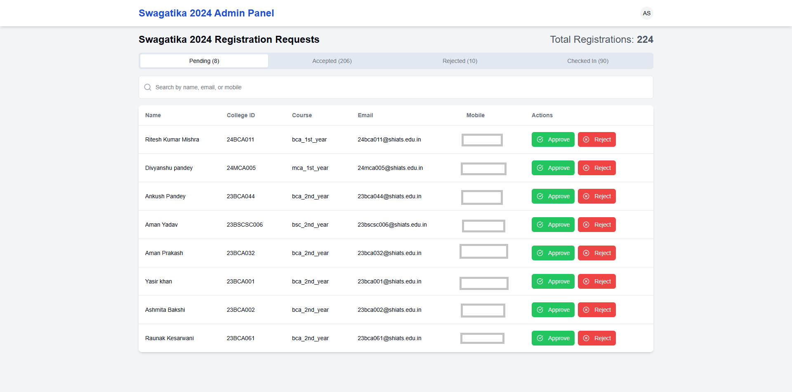
*Admin dashboard for managing events and tickets*


### QR Code Scanner
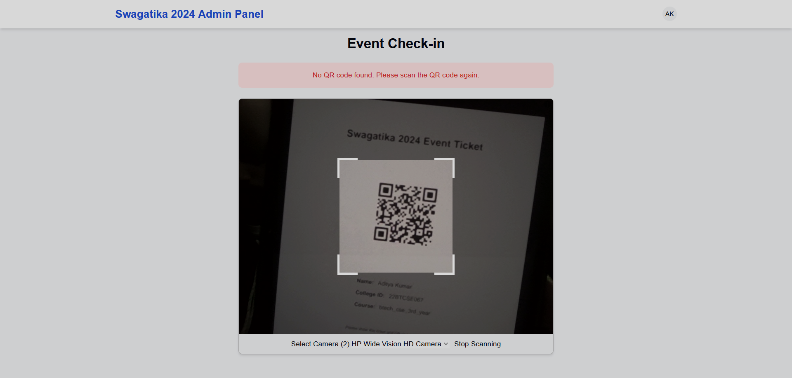
*QR code scanning interface for ticket validation*

### Ticket Validation
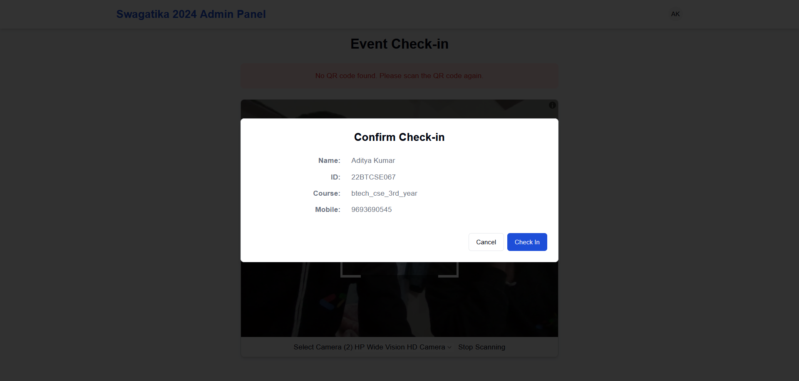
*Ticket validation interface*

### Ticket Validation - Checkin Success

*Ticket validation interface - checkin success*

### Ticket Validation - Duplicate Scan
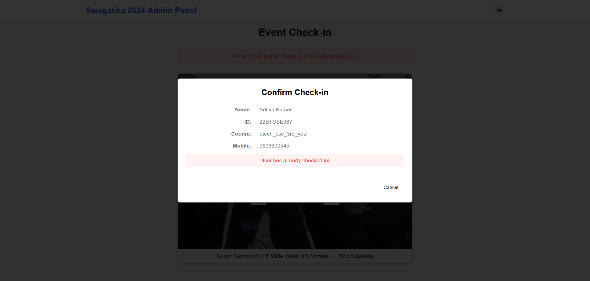
*Ticket validation interface - duplicate scan*

### Email Templates - Success Email
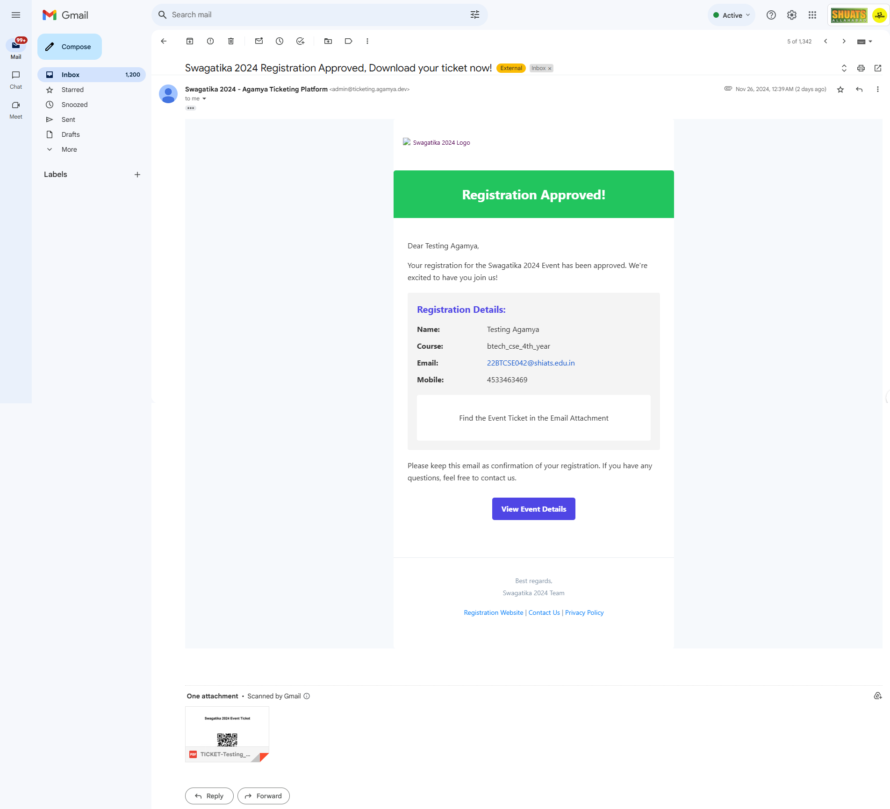
*Custom email template for ticket rejections*


### Email Templates - Rejection Email
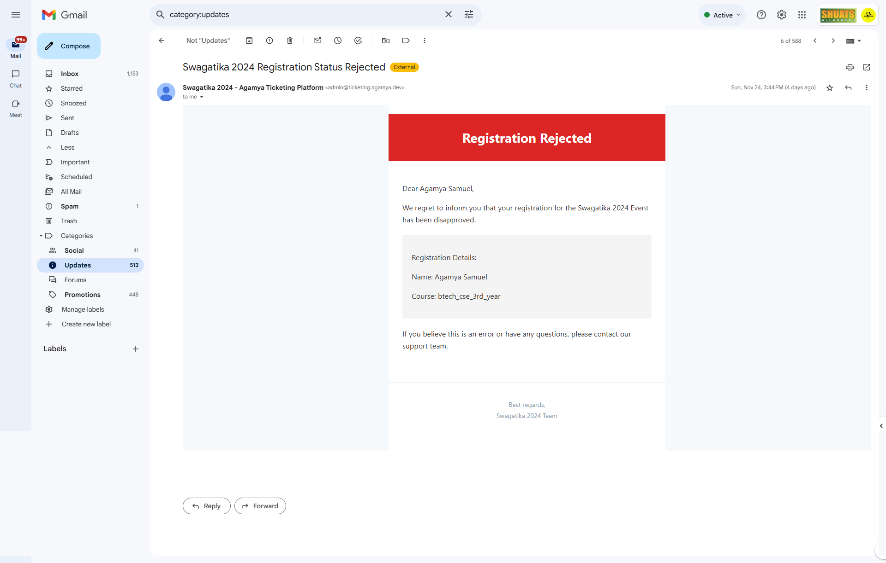
*Custom email template for ticket rejections*

### PDF Tickets
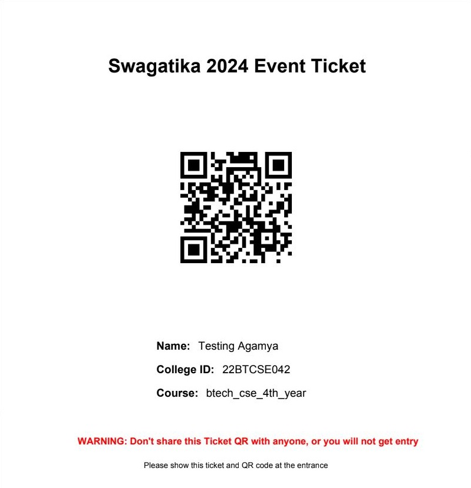
*Generated PDF ticket with QR code*

## 🤝 Contributing

Contributions are welcome! Please feel free to submit a Pull Request.

## 📄 License

This project is private and proprietary software.
